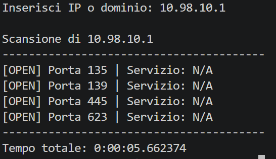

# Python Port Scanner 🔍

## Descrizione
Questo progetto è un **Network Port Scanner** efficiente sviluppato in Python. Il tool scansiona il range di porte standard (1–1024) su un indirizzo IP o dominio target per identificare le porte aperte e tentare di recuperare il "banner" (informazione identificativa) del servizio in esecuzione.

L'efficienza è garantita dall'uso del **multithreading**, che permette di scansionare centinaia di porte simultaneamente, riducendo drasticamente i tempi di attesa.
Il progetto è stato testato su ambiente virtuale Metasploitable


## Funzionalità
- Scansione porte 1–1024
- Multithreading per velocizzare il processo
- Rilevamento base dei servizi

## Tecnologie utilizzate
- Python
- Socket
- Threading

## Utilizzo
```bash 
scan python.py
```

## Screenshot

Esempio di esecuzione del tool:


